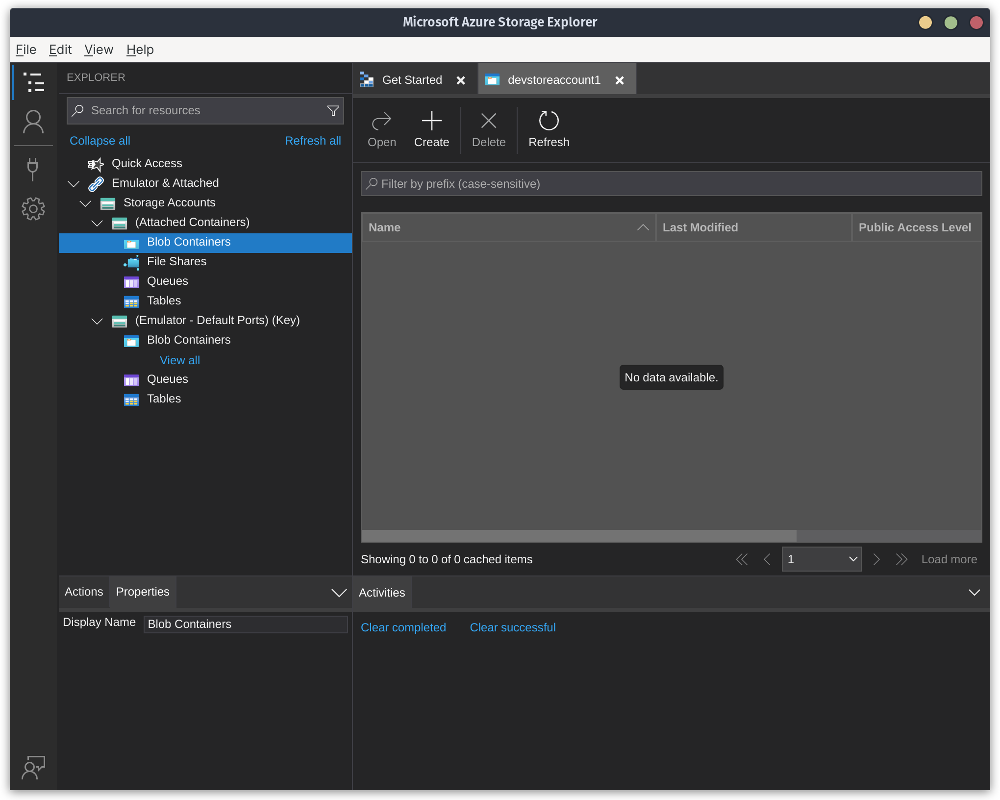
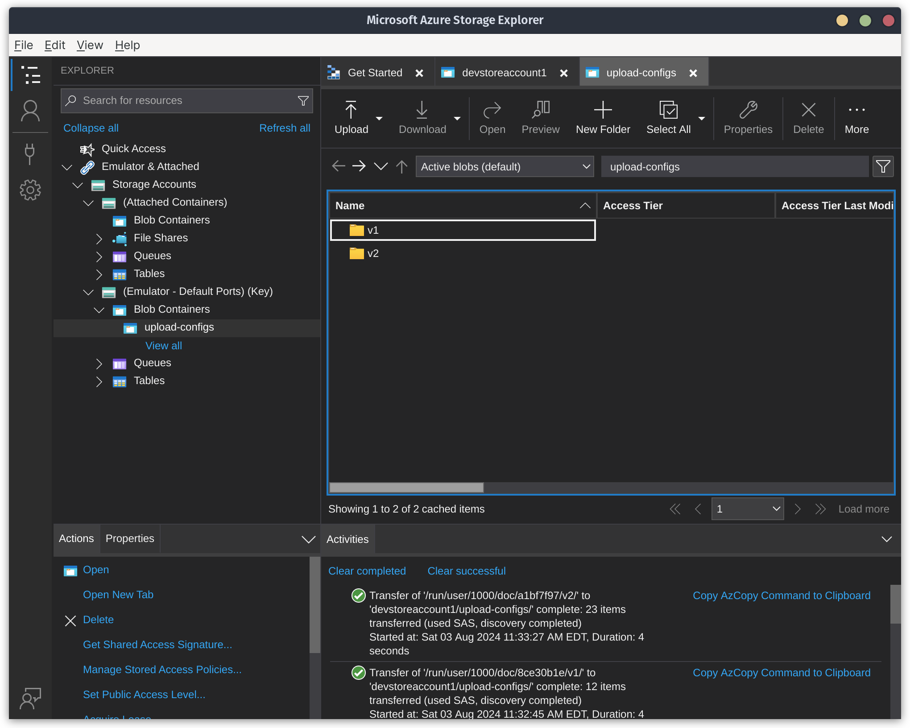

# DEX Upload API - Getting Started

Prerequisities: [Download and install Go](https://go.dev/doc/install). Run `go version` to verify you have Go installed.

Let's clone the Upload API repository:

```bash
git clone git@github.com:CDCgov/data-exchange-upload.git
```

The heart of the DEX Upload API is the _upload server_. The upload server is a wrapper around an open source product called [tus](https://tus.io/). 

Tus implements a resumable upload capability over HTTP. File chunks are sent to the API as HTTP `PATCH` requests. The final HTTP `PATCH` signals to tus to construct the file from the various chunks.

Resumable uploads like how Tus does them are highly beneficial for scalable architecture. It enables receipt of massively-sized files (think stuff in the TB size range) and is great for sending data over unreliable connections. A typical RESTful API would be unable to advertise those same benefits.

The downside to the resumable upload protocol is that it requires clients (i.e. those uploading to the Upload API) to write some client-side code. That client-side code is essentially breaking up a large file into chunks and sending them as HTTP `PATCH` requests.

The code for the upload server lives in the `upload-server` directory. Let's change directory (`cd`) to it:

```bash
cd upload-server
```

## Building the upload server:

Let's build the package:

```bash
go build ./cmd/main.go 
```

## Running tests:

Run the tests:

```bash
go test ./...
```

With coverage:

```bash
go test -coverprofile=c.out ./...
go tool cover -html=c.out
```

## Run locally with no dependencies:

And let's run the actual server:

```bash
go run ./cmd/main.go
```

You can visit `http://localhost:8080` in a browser to verify success. The following JSON should be displayed:

```json
{
  "system": "DEX",
  "dex_product": "UPLOAD API",
  "dex_app": "upload server",
  "server_time": "2024-08-03T10:58:51-04:00"
}
```

> `DEX` is the system name and is short for "Data Exchange." DEX has numerous products, such as a router, an API to check for the status of files, and of course the Upload API that is the subject of this article.

There's little use in running the server locally with no storage specified.

## Run locally with Azurite:

Install Azureite by following these instructions: https://learn.microsoft.com/en-us/azure/storage/common/storage-use-azurite?tabs=npm%2Cblob-storage. Note that there are several options available for how you can install it.

For the purposes of this document we'll assume you're running Azurite in an Docker container.

You'll also need to install [Azure Storage Explorer](https://azure.microsoft.com/en-us/products/storage/storage-explorer/).

```bash
docker pull mcr.microsoft.com/azure-storage/azurite
```

Depending on your installation method, you will need to create a folder to hold the data that Azurite will store. We'll assume you're using a Linux distribution or Windows Subsystem for Linux v2:

```bash
mkdir -p ~/data/azurite
```

> The `-p` flag in the `mkdir` command says to create the parent folder if it doesn't already exist.

Let's run the Docker image, specifying our storage path in the `run` command:

```bash
docker run -p 10000:10000 -p 10001:10001 -p 10002:10002 \
    -v ~/data/azurite mcr.microsoft.com/azure-storage/azurite
```

You should see the following output:

```
Azurite Blob service is starting at http://0.0.0.0:10000
Azurite Blob service is successfully listening at http://0.0.0.0:10000
Azurite Queue service is starting at http://0.0.0.0:10001
Azurite Queue service is successfully listening at http://0.0.0.0:10001
Azurite Table service is starting at http://0.0.0.0:10002
Azurite Table service is successfully listening at http://0.0.0.0:10002
```

Now [install Azure Storage Explorer](https://azure.microsoft.com/en-us/products/storage/storage-explorer/) if you haven't done so already. 

With Azurite running, opening Azure Storage Explorer should automatically detect Azurite's storage emulator:



If you start clicking around in the Azure Storage Explorer, your Azurite docker terminal window should start showing corresponding HTTP requests:

```
10.0.2.100 - - [03/Aug/2024:15:15:09 +0000] "GET /devstoreaccount1?comp=properties&restype=account HTTP/1.1" 200 -
10.0.2.100 - - [03/Aug/2024:15:15:12 +0000] "GET /devstoreaccount1?comp=list&include=metadata HTTP/1.1" 200 -
10.0.2.100 - - [03/Aug/2024:15:15:12 +0000] "GET /devstoreaccount1?comp=list&include=metadata&timeout=30 HTTP/1.1" 200 -
10.0.2.100 - - [03/Aug/2024:15:15:12 +0000] "GET /devstoreaccount1/%24logs?restype=container HTTP/1.1" 404 -
10.0.2.100 - - [03/Aug/2024:15:15:12 +0000] "GET /devstoreaccount1/%24blobchangefeed?restype=container HTTP/1.1" 404 -
10.0.2.100 - - [03/Aug/2024:15:15:38 +0000] "GET /devstoreaccount1?comp=list&include=metadata HTTP/1.1" 200 -
10.0.2.100 - - [03/Aug/2024:15:15:39 +0000] "GET /devstoreaccount1/%24logs?restype=container HTTP/1.1" 404 -
10.0.2.100 - - [03/Aug/2024:15:15:39 +0000] "GET /devstoreaccount1/%24blobchangefeed?restype=container HTTP/1.1" 404 -
10.0.2.100 - - [03/Aug/2024:15:15:39 +0000] "GET /devstoreaccount1?restype=service&comp=properties HTTP/1.1" 200 -
10.0.2.100 - - [03/Aug/2024:15:15:39 +0000] "GET /devstoreaccount1?comp=list&maxresults=5000&include=metadata HTTP/1.1" 200 -
10.0.2.100 - - [03/Aug/2024:15:15:39 +0000] "GET /devstoreaccount1/%24logs?restype=container HTTP/1.1" 404 -
10.0.2.100 - - [03/Aug/2024:15:15:39 +0000] "GET /devstoreaccount1/%24blobchangefeed?restype=container HTTP/1.1" 404 -
10.0.2.100 - - [03/Aug/2024:15:15:40 +0000] "GET /devstoreaccount1?comp=list&include=metadata&timeout=30 HTTP/1.1" 200 -
10.0.2.100 - - [03/Aug/2024:15:15:40 +0000] "GET /devstoreaccount1/Tables HTTP/1.1" 200 -
```

We have to create some configuration files in Azure storage in order for Upload API to work. Create a new blob container called `upload-configs`. Then, upload the `v1` and `v2` folders (located in the GitHub repo's `upload-configs` folder) to the `upload-config` blob storage container:




## High-level Code Walkthrough

In Go, the `init` function runs before any other piece of code, even before the `main` function. It can be used to initialize a specific state of the application. For example, one might wish to find out the type of operating system currently running before executing the rest of the code.

